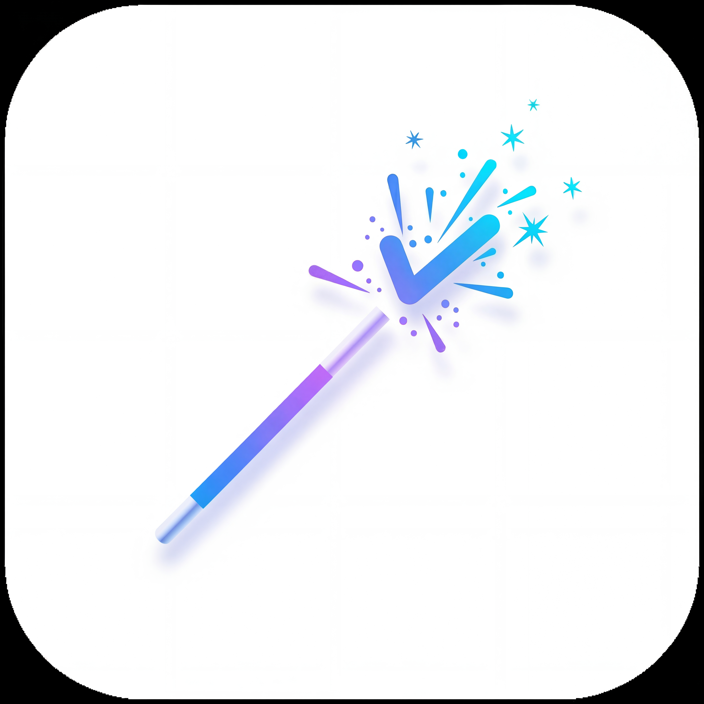

# TaskWizard (Open-AutoGLM Android Client)

<p align="center">
  
</p>

> An Android native client for Open-AutoGLM - AI-powered phone automation framework

[](https://developer.android.com/)
[](https://kotlinlang.org/)
[](LICENSE)

## Overview

**TaskWizard** is a native Android application that brings the power of [Open-AutoGLM](https://github.com/zai-org/Open-AutoGLM) to your device. It uses AI vision models to understand screen content and automatically perform tasks on your phone through natural language commands.

### Key Features

- **AI-Powered Automation**: Use natural language to control your phone
- **Visual Understanding**: AI analyzes screenshots to understand context
- **Floating Overlay**: Real-time task status with a beautiful overlay interface
- **Shizuku Integration**: System-level privileges for advanced automation
- **100+ App Support**: Works with WeChat, Taobao, Meituan, and more
- **Privacy-First**: All processing happens locally or with your own API

## Project Origin

This is an Android native port of the original [Open-AutoGLM](https://github.com/zai-org/Open-AutoGLM) Python project. While the original runs on a PC controlling your phone via ADB, TaskWizard runs entirely on your Android device.

**Key Differences from Original:**

| Feature | Open-AutoGLM (Python) | TaskWizard (Android) |
|---------|----------------------|---------------------|
| Platform | PC with ADB connection | Native Android app |
| Architecture | Python + ADB/HDC | Kotlin + Shizuku |
| Screen Capture | ADB shell | System screenshot API |
| Input | ADB Keyboard | Shizuku input injection |
| Model Calls | Remote API | Remote API (configurable) |
| UI | Terminal/Python script | Jetpack Compose native UI |

## How It Works

```
User Command
    ↓
AI Model Analysis (screenshot + prompt)
    ↓
Action Generation (Tap, Swipe, Type, etc.)
    ↓
Shizuku Execution (system-level operations)
    ↓
Screenshot Verification
    ↓
Loop Until Task Complete
```

## Requirements

- **Android**: 8.0 (API 26) or higher
- **Shizuku**: Must be installed ([Download](https://github.com/RikkaApps/Shizuku/releases))
- **ADB Keyboard**: Required for text input ([Download](https://github.com/senzhk/ADBKeyBoard/blob/master/ADBKeyboard.apk))
- **API Access**: AutoGLM-compatible model API (see [Model Options](#model-options))

## Installation

### Method 1: Build from Source

```bash
# Clone the repository
git clone https://github.com/yourusername/Open-AutoGLM.git
cd Open-AutoGLM

# Build debug APK
./gradlew assembleDebug

# Install on device
adb install app/build/outputs/apk/debug/app-debug.apk
```

### Method 2: Download Release APK

Download the latest APK from the [Releases](https://github.com/yourusername/Open-AutoGLM/releases) page.

## Setup Guide

### 1. Install Shizuku

1. Download [Shizuku APK](https://github.com/RikkaApps/Shizuku/releases)
2. Install and open Shizuku
3. Start Shizuku service (follow in-app instructions)
4. Grant TaskWizard Shizuku permission when prompted

### 2. Install ADB Keyboard

1. Download [ADB Keyboard APK](https://github.com/senzhk/ADBKeyBoard/blob/master/ADBKeyboard.apk)
2. Install on your device
3. Enable in Settings → Language & Input → Current Keyboard → ADB Keyboard

### 3. Configure API Settings

Open TaskWizard and navigate to Settings:

| Setting | Description | Example |
|---------|-------------|---------|
| **API Key** | Your model API key | `sk-xxxxx` |
| **Base URL** | Model API endpoint | `https://open.bigmodel.cn/api/paas/v4` |
| **Model Name** | Model to use | `autoglm-phone` or `autoglm-phone-9b` |

### 4. Grant Permissions

- **Overlay Permission**: Required for floating task status
- **Shizuku Permission**: Required for system operations
- **Notification Permission**: Required for foreground service

## Model Options

### Option 1: Zhipu BigModel (Recommended)

```kotlin
Base URL: https://open.bigmodel.cn/api/paas/v4
Model: autoglm-phone
API Key: Get from https://open.bigmodel.cn/
```

### Option 2: ModelScope (魔搭社区)

```kotlin
Base URL: https://api-inference.modelscope.cn/v1
Model: ZhipuAI/AutoGLM-Phone-9B
API Key: Get from https://modelscope.cn/
```

### Option 3: Self-Hosted Model

Deploy your own model using vLLM or SGLang:

```bash
# vLLM example
vllm serve zai-org/AutoGLM-Phone-9B \
  --max-model-len 8192 \
  --limit-mm-per-prompt '{"image": 10}' \
  --guided-decoding-backend lm-format-enforcer
```

Then set your Base URL to `http://your-server-ip:8000/v1`.

## Supported Apps

TaskWizard supports 100+ Android apps across categories:

| Category | Apps |
|----------|------|
| **Social** | WeChat, QQ, Weibo, WhatsApp, Telegram, X/Twitter |
| **E-commerce** | Taobao, JD.com, Pinduoduo, Temu |
| **Food Delivery** | Meituan, Ele.me, KFC |
| **Travel** | Ctrip, 12306, Qunar, Didi |
| **Video** | Bilibili, Douyin, Kuaishou, Tencent Video, iQiyi |
| **Music** | NetEase Cloud Music, QQ Music, Ximalaya |
| **Maps** | Amap (Gaode), Baidu Maps |
| **Lifestyle** | Xiaohongshu, Douban, Zhihu |

See [AppMap.kt](app/src/main/java/com/taskwizard/android/config/AppMap.kt) for the full list.

## Usage

### Basic Task Execution

1. Open TaskWizard
2. Type your command in natural language:
   - "Open WeChat and send message to file transfer helper: Hello World"
   - "Open Meituan and search for hotpot nearby"
   - "Go to Taobao and search for wireless headphones"
3. Press the START button
4. Watch the overlay show real-time progress

### Supported Actions

| Action | Description | Example |
|--------|-------------|---------|
| `Launch` | Open an app | `do(action="Launch", app="WeChat")` |
| `Tap` | Click on screen | `do(action="Tap", element=[500, 500])` |
| `Type` | Input text | `do(action="Type", text="hello")` |
| `Swipe` | Scroll/swipe | `do(action="Swipe", start=[200,800], end=[200,200])` |
| `Back` | Go back | `do(action="Back")` |
| `Home` | Return to home | `do(action="Home")` |
| `Wait` | Wait for loading | `do(action="Wait", duration="2 seconds")` |
| `Take_over` | Request manual help | `do(action="Take_over", message="Please login")` |

### Task Status

During task execution, the overlay shows:
- **Thinking**: AI reasoning process
- **Action**: Current operation being performed
- **Steps**: Number of steps taken
- **Progress**: Visual progress indicator

## Architecture

```
TaskWizard/
├── ui/                     # Jetpack Compose UI
│   ├── screens/           # Main, Settings screens
│   ├── components/        # Reusable UI components
│   ├── overlay/           # Floating overlay UI
│   └── viewmodel/         # State management
├── core/                   # Core automation logic
│   ├── AgentCore.kt       # AI agent orchestration
│   ├── ActionExecutor.kt  # Shizuku action execution
│   └── ResponseParser.kt  # Model response parsing
├── api/                    # Network layer
│   └── AutoGLMService.kt  # Retrofit API client
├── manager/                # System integration
│   └── ShizukuManager.kt  # Shizuku connection & IPC
├── config/                 # Configuration
│   ├── AppMap.kt          # App package mappings
│   ├── SystemPrompt.kt    # AI system prompt
│   └── TimingConfig.kt    # Timing constants
├── service/                # Android services
│   └── OverlayService.kt  # Foreground overlay service
└── utils/                  # Utilities
    ├── SettingsManager.kt  # Persistence
    └── TaskScope.kt       # Coroutine scope
```

## Development

### Build Requirements

- JDK 11 or higher
- Android SDK 34
- Kotlin 2.0.0
- Gradle 8.1.0

### Building

```bash
# Debug build
./gradlew assembleDebug

# Release build (requires signing config)
./gradlew assembleRelease

# Run tests
./gradlew test

# Run lint
./gradlew lint
```

### Code Signing

Release builds require keystore configuration. See [RELEASE_SETUP.md](RELEASE_SETUP.md) for details.

## Troubleshooting

### Shizuku Not Connected

1. Make sure Shizuku service is running
2. Open Shizuku app and check service status
3. Restart Shizuku service if needed

### ADB Keyboard Not Working

1. Verify ADB Keyboard is enabled in Settings
2. Check if ADB Keyboard is set as current input method
3. Re-enable ADB Keyboard if needed

### API Connection Failed

1. Check your network connection
2. Verify API Base URL is correct
3. Confirm API Key is valid
4. Check if model service is running (for self-hosted)

### Overlay Not Showing

1. Grant overlay permission in Settings → Apps → TaskWizard
2. Check if Battery Optimization is disabled for TaskWizard
3. Ensure Notification permission is granted

## Contributing

Contributions are welcome! Please:

1. Fork the repository
2. Create a feature branch
3. Make your changes
4. Submit a pull request

## License

This project is licensed under the Apache License 2.0 - see the [LICENSE](LICENSE) file for details.

## Acknowledgments

- [Open-AutoGLM](https://github.com/zai-org/Open-AutoGLM) - Original Python framework
- [Shizuku](https://github.com/RikkaApps/Shizuku) - System privilege framework
- [Jetpack Compose](https://developer.android.com/jetpack/compose) - Modern UI toolkit

## Disclaimer

This project is for research and learning purposes only. Please comply with all applicable laws and terms of service when using this application.

## Links

- [Original Open-AutoGLM](https://github.com/zai-org/Open-AutoGLM)
- [Shizuku Documentation](https://shizuku.rikka.app/)
- [Issue Tracker](https://github.com/yourusername/Open-AutoGLM/issues)

---

Made with ❤️ by the TaskWizard team
